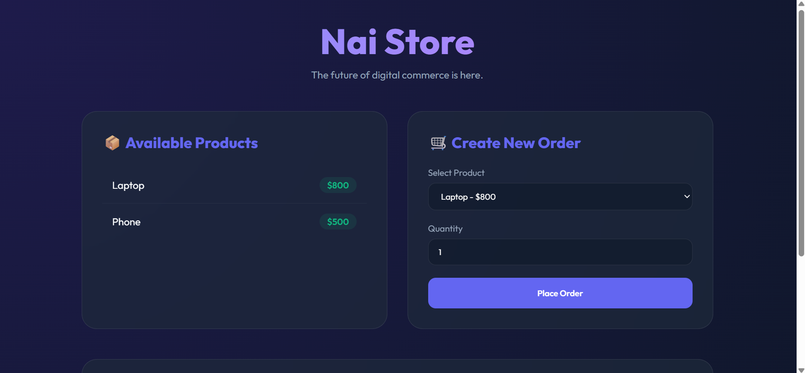

## NaiStore - RDBMS Implementation
This is a simple design and implementation of a relational database management system (RDBMS) done in python(FastAPI) that supports declaring tables, CRUD operations, basic indexing and unique keying and some joining. The interface is in SQL and it has an interactive REPL mode. 

### Features
- Declare tables with columns and data types
- CRUD operations on tables
- Basic indexing and unique keying
- Some joining operations
- Interactive REPL mode

### Installation and usage
- Clone the repository
- Install dependencies ('pip install fastapi uvicorn')
- Run the application ('uvicorn ecommerce_app:app --reload')
- Open http://localhost:8000 in your browser
- Use the interactive REPL mode to declare tables, perform CRUD operations, and more

### Landing Page

